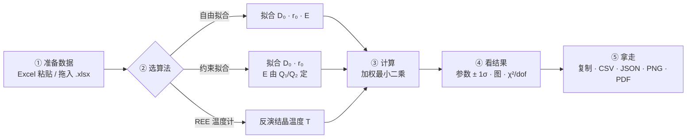

# 锆石–熔体 REE 分配系数工具（网页版）

把本仓库三个各自独立的 Python 脚本整合成**一个单文件、完全离线的网页应用**：
打开 → 贴数据 → 点计算 → 拿结果。不需要装 Python，不需要联网，数据不出本机。

本版新增：**多组带真值的示例数据**、**算法验证页**（反向检验 + 蒙特卡洛 + 敏感性）、
**浓度 → 分配系数 D 换算**小工具、**温度计参数敏感性表**。



## 怎么用

双击 **`锆石熔体REE工具.html`**。首页「总览 · 流程」给出流程图与「我该用哪个？」三张卡片，
点「开始 →」进入对应模块；三个模块都已预载示例并算好结果。

- **输入**：从 Excel 复制粘贴（Tab / 逗号 / 空格都认），或拖入 `.xlsx` / `.csv`。
  表头自动识别（Element / ri / Di / 1s / T / P），认错了展开「高级设置」改。
- **示例数据**：下拉框可选 —— 两组**真实数据**（Burnham & Berry 2012 实验；Whitehouse & Kamber 2002 自然样品）
  与四组**合成数据**（真值写在数据说明里，用来检验恢复能力）。
- **输出**：结果卡 + 可贴进论文的格式化文本 + 统计表 + 拟合图/残差图；复制、CSV、JSON、PNG、打印 PDF。
- **浓度 → D**：手里只有锆石与熔体（全岩）浓度时，先在总览页算出 D 再粘进模块③。

地址栏后缀：`#tab=m2` 直达模块，`#selftest` 跑内置自检。

## 示例数据集（真值均已知）

| 数据集 | 类型 | 温度 | 说明 |
|---|---|---|---|
| Burnham & Berry (2012) | 实验 | 1295 °C 已知 | 仓库自带，13 个元素；**反向检验**用 |
| Whitehouse & Kamber (2002) | 自然样品 | 未知 | 仓库里表名叫 `Whitehouse Data`；**模型已知失效**的反面案例 |
| 合成 A / B / C | 合成 | 1000 / 800 / 1300 °C | 真值 D₀、r₀、E 见界面说明，用于检验恢复能力 |
| 合成温度计 | 合成 | 900 / 1100 / 1300 °C | 三个样品各带已知温度，检验反演偏差 |

## 算法验证（重点）

数字全部由 `webgui/validate.py` 生成（`validation.json` / `validation.md`），网页只负责显示。

**A. 反向检验** —— 拿温度**独立已知**的实验数据考温度计（Burnham & Berry 2012，1295 °C = 1568.15 K）：

| 参数组合 | 反演 T | 与实验温度之差 |
|---|---|---|
| **Q₁ + r₀=0.93 + Streicher（默认）** | **1555.8 K** | **−12.4 K** |
| Q₁ + r₀=0.95 + Streicher | 1658.2 K | +90.1 K |
| Q₂ + r₀=0.93 + Streicher | 1514.1 K | −54.1 K |
| Q₁ + r₀=0.93 + Rubatto | 1390.3 K | −177.9 K |

- 同一份数据的晶格应变拟合很好：RMS(log₁₀D) = 0.069 dex（≈17%），r₀ = 0.9562 ± 0.0104 Å，E = 614.5 ± 92.8 GPa。
- **但 8 种参数组合的 T 跨度达 307 K（−217 ～ +90 K），而数据噪声只贡献 ±64～158 K** ——
  **误差预算由模型常数的选择主导，不是数据点**。把 Rubatto 的 D₀(T) 关系用在干体系高温实验上会偏 −150～−220 K，
  所以 D₀(T) 关系必须与被测体系匹配。

**A2. 反面案例** —— Whitehouse & Kamber (2002) 自然样品（该文自身结论就是 LREE 相对晶格应变模型超丰度）：
自由拟合的 D₀ 直接顶到搜索上界 2000、r₀ 掉到 0.83–0.85 Å（锆石位点半径本应 0.93–0.96 Å），
LREE 残差高达 1.4 dex（24 倍）。工具的应对是给出「触及参数边界」警告并把残差画出来，
**而不是输出一个看似漂亮的拟合**。

**B. 蒙特卡洛误差标定**（合成数据、真值已知，每组 400 次重复）：

- 模块①②：D₀ / r₀ / E 的相对偏差都在 ±0.5% 以内；**1σ 覆盖率 0.65–0.73**、**2σ 覆盖率 0.94–0.97**
  （理想值 0.68 / 0.95）→ 报出的误差是可信的。
- 模块③：偏差 +0.1 ～ +5.2 K，RMSE 1.4–15 K，1σ 覆盖率 0.61–0.71。
- 模型误用（生成与反演用不同常数）：Q₂/r₀=0.95 生成 → Q₁/r₀=0.93 反演偏 −47～−64 K；
  Streicher 生成 → Rubatto 反演偏 −13～−118 K。

**C. 敏感性**：

- r₀ 与 E 高度相关（corr ≈ 0.67–0.81）；点数越少 ±1σ 越大；4 个点且半径断档时**参数不可辨识**（界面会警告）。
- 同一数据换权重方式（线性不加权 ↔ 对数域等权）会带来 −55 ～ +53 K 的系统差异 —— 这是方法选择，不是数据误差。
- 模块③里内置了 8 种参数组合的实时对比表，可直接看到自己数据的这个跨度。

## 文献数据：哪些能验、哪些拿不到

| 数据集 | DOI | 获取情况 |
|---|---|---|
| Burnham & Berry (2012) GCA 95, 196–212 | 10.1016/j.gca.2012.07.034 | 已在仓库内 |
| Whitehouse & Kamber (2002) EPSL 204, 333–346 | 10.1016/s0012-821x(02)01000-2 | 已在仓库内 |
| Rubatto & Hermann (2007) Chem Geol 241, 38–61 | 10.1016/j.chemgeo.2007.01.027 | 付费，无合法开放副本 |
| Luo & Ayers (2009) GCA 73, 3656–3679 | 10.1016/j.gca.2009.03.027 | 付费，无合法开放副本 |
| Thomas et al. (2002) GCA 66, 2885–2898 | 10.1016/s0016-7037(02)00881-5 | 付费，无合法开放副本 |

2026-09-18 用 Unpaywall / OpenAlex / Semantic Scholar 逐一查过，后三篇都没有开放副本，
因此**本仓库不使用它们的数字**（不编造）。拿到 PDF 后把 D(REE) 表贴进模块③即可做同样的反向检验。

**关于锆石标样**（91500 / Plešovice / GJ-1 / Temora / Mud Tank）：它们是 U–Pb 与微量元素的
「锆石端元」参考物质，只给出锆石自身的浓度。本工具三个模块的输入都是分配系数
`D = C_锆石 / C_熔体`，缺熔体端就构不成 D，所以**标样数据不能直接用于温度反演**；
要用就得配对的锆石 + 熔体（或全岩）分析 —— 总览页的「浓度 → D」小工具就是为这一步准备的。

## 数值可信度

```
python webgui/validate.py     # 反向检验 + 蒙特卡洛 + 敏感性  → validation.json/md
python webgui/make_data.py    # scipy 紧容差求真最优解 → src/data.js + reference.json
python webgui/make_demos.py   # 示例数据集与验证块 → src/demos.js
node   webgui/test_math.js    # 77 项逐位对照（JS 求解器 vs scipy）
node   webgui/check_ids.js    # DOM id 静态检查
python webgui/build.py        # 合成单文件 HTML
```

- JS 求解器与 scipy 是**两套独立实现**：`test_math.js` 77 项对照，最大相对偏差 **6.3×10⁻¹⁰**，
  且 JS 解的加权 SSR 更低（已到双精度噪声底）。
- 原脚本的 `maxfev=50` 使其解偏离真最优解约 **2×10⁻⁶** 相对 —— 在它输出的 2–3 位小数上看不出来，
  但说明它没跑透。
- 浏览器内置自检 15 项（硬编码参考值、正演–反演闭合、标签页、6 张图表是否真的绘制），
  Edge 无头模式 **15/15**。

## 已知局限

- 压力 P 不参与计算（与原脚本一致），仅作图注。
- 温度计 ±1σ 只反映数据点分散度；**绝对准确度取决于 Q / r₀ / D₀(T) 的选取（约 300 K 量级）**，
  所以务必配合模块③里的 8 组合敏感性表一起解读。
- 无权重或 D 跨多个数量级时，界面按对数域等权拟合；原脚本是线性域不加权，两者会差几十 K。
- 只读 xlsx 第一个工作表；旧版 `.xls` 不支持；xlsx 解压需 `DecompressionStream`（Chrome/Edge 103+）。

## 出处

算法与示例数据来自 Streicher, L.B., van Westrenen, W., Hanchar, J.M., Brouwer, F.M. (2023)
*Geochimica et Cosmochimica Acta* 346, 54–64（doi:10.1016/j.gca.2023.01.030）配套代码，
原作者 Linus Streicher（VU Amsterdam）。示例数据取自 Burnham & Berry (2012) *GCA* 95, 196–212
与 Whitehouse & Kamber (2002) *EPSL* 204, 333–346。
