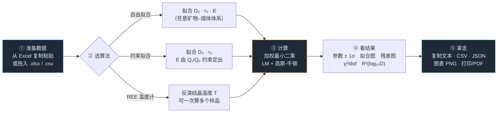

# 锆石–熔体 REE 分配系数工具（网页版）

把本仓库三个各自独立的 Python 脚本整合成**一个单文件、完全离线的网页应用**：
打开 → 贴数据 → 点计算 → 拿结果。不需要装 Python，不需要联网，数据不出本机。



| 模块 | 原脚本 | 你输入 | 你得到 |
|---|---|---|---|
| ① 自由拟合 | `Non_Linear_Fit_Code/3_Non_Linear_Regression.py` | 元素 · ri · Di · 1s，温度 T、压力 P | D₀ ± 1σ、r₀ ± 1σ (Å)、E ± 1σ (GPa) |
| ② 约束拟合（锆石） | `Non_Linear_Fit_Code/4_Non_Linear_Regression_Constrained.py` | 元素 · ri · Di · 1s，温度 T、约束常数 Q | D₀ ± 1σ、r₀ ± 1σ (Å)、E (GPa，由 Q 推出) |
| ③ REE 温度计 | `T_Calc_D(Zircon-melt)/T_Calc_Application.py` | ri 一列 + 每个样品一列 D | 每个样品的 T ± 1σ（K 与 °C） |

## 怎么用

双击 **`锆石熔体REE工具.html`**（Chrome / Edge / Firefox）。打开后停在「总览 · 流程」页，
上面有流程图和「我该用哪个？」三张卡片，点「开始 →」进入对应模块。
三个模块都已预先载入示例数据并算好结果，想用自己的数据直接覆盖即可。

- **输入**：从 Excel 复制粘贴到文本框（Tab / 逗号 / 空格分隔都认）；或把 `.xlsx` / `.csv` 拖进去。
  表头自动识别（Element / ri / Di / 1s / T / P），认错了展开左侧「高级设置」手动指定列。
  只有元素名时，点「补全 ri」按 Shannon (1976) 八次配位半径自动填。
- **输出**：大字号结果卡 + 可直接贴进论文的格式化文本 + 统计表 + 拟合图/残差图；
  一键复制、导出 CSV / JSON / PNG，或打印成 PDF（含整页报告排版）。

地址栏后缀：`#tab=m2` 直达某个模块，`#selftest` 自动跑内置自检。

## 与原脚本的关系

- **模型公式逐字照抄**，没有改动任何物理/化学假设；P 与原脚本一样只作图上标注。
- 差别只在求解器：原脚本用 `scipy.optimize.curve_fit`，且把迭代上限写成 `maxfev=50`；
  本工具改用自研的有界 Levenberg–Marquardt + 高斯-牛顿抛光（解析雅可比）。
- 新增：误差含义可选「绝对 1σ / 相对百分数 / 不加权」，误差标度可选 `absolute_sigma` 的两种取值，
  以及 χ²/dof、RMSWD、R²(log₁₀D)、残差图、多方案对比。

## 数值可信度

```
python webgui/make_data.py     # 用 scipy 紧容差求真最优解 → reference.json
node   webgui/test_math.js     # 77 项对照
node   webgui/check_ids.js     # DOM id 静态检查
python webgui/build.py         # 合成单文件 HTML
```

- 参考值来自 scipy `least_squares(method='lm', xtol=ftol=gtol=1e-15)` + 高斯-牛顿抛光，即**真最优解**。
- `test_math.js` 共 **77 项，全部通过，最大相对偏差 6.3×10⁻¹⁰**；且本工具解的加权 SSR
  比参考解更低（7.14511214444633×10⁻¹ vs 7.14511214444635×10⁻¹），说明已到双精度噪声底。
- 原脚本默认设置（`maxfev=50`）的解与真最优解相差约 2×10⁻⁶ 相对 —— 在它输出的 2–3 位小数上
  不可见，但说明它没跑透。
- 浏览器内置自检 15 项（硬编码参考值、正演–反演闭合、标签页切换、6 张图表是否真的绘制），
  在 Edge 无头模式下 15/15 通过；单文件另拷到别的目录同样 15/15。

## 已知局限

- 压力 P 不参与计算（与原脚本一致），仅作图注。
- 温度计是无权重拟合（原脚本不给 σ），所以不报 χ²/dof，改报对数域残差的 RMS 与最大偏差；
  给出的 ±1σ 只反映数据点分散度，不是真实地质不确定度。
- 只读 xlsx 的第一个工作表；旧版 `.xls` 不支持（请另存为 .xlsx 或 .csv）。
- xlsx 解压需要 `DecompressionStream`（Chrome/Edge 103+、Firefox 113+）；老浏览器请用 CSV 粘贴。

## 出处

算法与示例数据来自 Streicher, L.B., van Westrenen, W., Hanchar, J.M., Brouwer, F.M. (2023)
*Geochimica et Cosmochimica Acta* 346, 54–64 的配套代码，原作者 Linus Streicher（VU Amsterdam）。
示例数据取自 Burnham & Berry (2012) *GCA* 95, 196–212。
